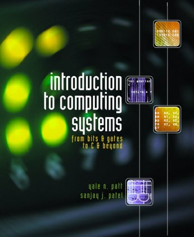
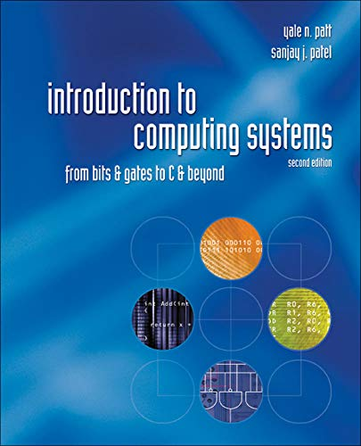
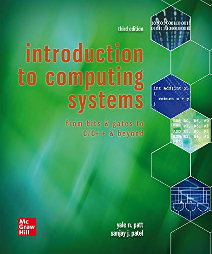

# Awesome LC-3

Resources related to the fictitious [LC-3](https://en.wikipedia.org/wiki/Little_Computer_3) ("Little Computer 3") [ISA](https://en.wikipedia.org/wiki/Instruction_set_architecture).

## Books

The LC series of computers are described in the editions of "Introduction to Computing Systems: From Bits & Gates to C & Beyond" by Yale Patt and Sanjay Patel.

- The first edition describes the LC-2
  - ISBN-10 [0072440392](https://isbnsearch.org/isbn/0072440392) ([ebay](https://www.ebay.com/sch/i.html?_nkw=0072376902))
  - Publisher website (via wayback): https://web.archive.org/web/20160306140721/http://www.mhhe.com/engcs/compsci/patt/lc2unix.mhtml

- The second edition describes the LC-3
  - ISBN-10 [0072467509](https://isbnsearch.org/isbn/0072467509) ([ebay](https://www.ebay.com/sch/i.html?_nkw=0072467509))
  - Publisher website: https://highered.mheducation.com/sites/0072467509/

- The third (current) edition also describes the LC-3
  - ISBN-10 [1260150534](https://isbnsearch.org/isbn/1260150534)
  - Publisher website: https://highered.mheducation.com/sites/1260150534/student_view0/index.html

There is another variant, called the LC-3b, which is byte-addressable and adds bit shifting instructions.
Though there are PDFs available online of a few chapters describing the LC-3b, it appears these PDFs are from an as-yet unpublished version of "Introduction to Computing Systems".  See the ["Handouts" page](https://users.ece.utexas.edu/~patt/21s.460n/handouts.html) of the EE 460N course website.
